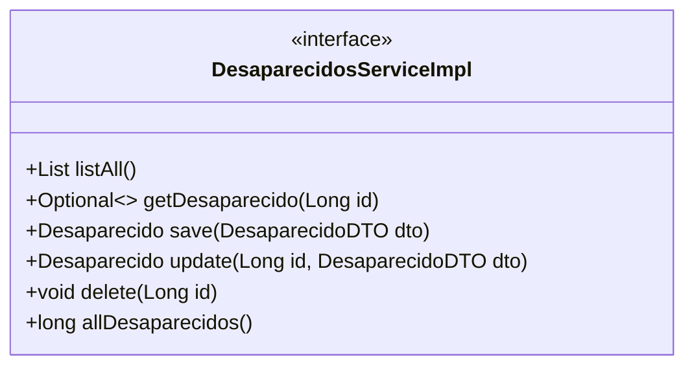
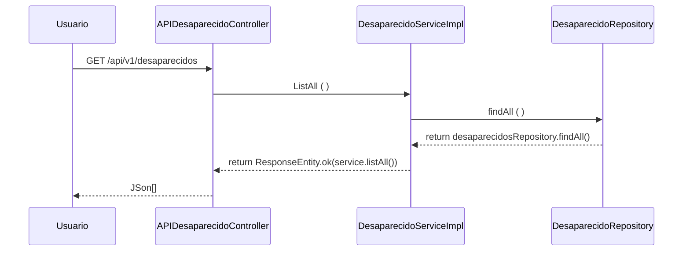

# Api - Radar - Spring Boot (STS)
### Fatec ZL - Centro Paula Souza
##### Disciplina - Programação Web III
Grupo 7
- [Ernesto Amorim](https://github.com/Erne1984)
- [Leornado Leal de Albuquerque](https://github.com/Leohgb)
- [Pablo Angel Choque Flores](https://github.com/PACFWL)
- [Silas Leite](https://github.com/LeiteSS)
##### Processo de Desenvolvimento de Software - PDS
> O Projeto Interdisciplinar segue uma abordagem interativa incremental adaptada do Scrum (exigência designada). Cada interação tem uma definição de pronto estabelecida com objetivo de controlar a qualidade. Ao longo das Sprints, o modelo desenvolveu semelhanças com a abordagem Waterfall, pois demonstrou falha no cumprimento do requisito essencial de concluir cada recurso dentro do prazo designado para cada Sprint.
##### Estudo de Caso – Sistema Integrado de Gestão
> O sistema RADAR proverá a divulgação de pessoas desaparecidas e cadastrar voluntários.
Esses voluntários irão receber mensagens a respeito de desaparecimentos próximos da região
de onde ele mora e na página onde será divulgado os desaparecidos haverá além dos detalhes
sobre a criança, adolescente ou adulto desaparecido; quem o voluntario deve contatar para
reportar novas informações.
Será integrado back-end ao sistema junto com um banco de dados com as informações
necessárias para entrar nas conformidades do projeto
##### Product Backlog
| ID | Módulo | Sprint | Nome | Como um (a) | Eu quero ser capaz de | Para que eu | Prioridade | Status |
|----------|----------|----------|----------|----------|----------|----------|----------|----------|
| 1  | Desaparecido   | 5   | Inserir Desaparecido   | Funcionário   | Registrar um desaparecido (refere-se ao conjunto dados relacionados à este) no sistema (neste caso uma aplicação web)   | Possa ter registros de desaparecidos   | Alta   | Concluído**   |
| 2  | Desaparecido   | 5  | Consultar Desaparecido  | Funcionário  | Consultar um desaparecido (refere-se ao conjunto dados relacionados à este) no sistema (neste caso uma aplicação web)  | Possa especionar registros de desaparecidos  | Alta  | Concluído  |
| 3  | Desaparecido   | 5  | Atualizar Desaparecido  | Funcionário  | Atualizar um desaparecido (refere-se ao conjunto dados relacionados à este) no sistema (neste caso uma aplicação web)  | Consiga modificar registros de desaparecidos  | Alta  | Concluído  |
| 4  | Desaparecido   | 5  | Deletar Desaparecido  | Funcionário  | Excluir um desaparecido (refere-se ao conjunto dados relacionados à este) no sistema (neste caso uma aplicação web)  | Possa excluir registros de desaparecidos  | Alta  | Concluído  |
| 5  | Desaparecido   | 5  | Quantificar Desaparecidos  | Funcionário  | Total de desaparecidos (refere-se ao conjunto dados relacionados à este) cadastrados no sistema(neste caso uma aplicação web)  | Possa obter a totalidade (Quantificação) de desaparecidos  | Média  | Concluído |
| 6  | Funcionário   | 3  | Inserir Funcionário  | Administrador  | Registrar um funcionário(refere-se ao conjunto dados relacionados à este) no sistema (neste caso uma aplicação web)  | Possa ter registros de funcionários  | Alta  | Concluído  |
| 7  | Funcionário   | 3  | Consultar Funcionário  | Administrador  | Consultar um funcionário(refere-se ao conjunto dados relacionados à este) no sistema (neste caso uma aplicação web)  | Possa especionar registros de funcionários | Alta  | Concluído  |
| 8  | Funcionário   | 3  | Atualizar Funcionário  | Administrador  | Atualizar um funcionário (refere-se ao conjunto dados relacionados à este) no sistema (neste caso uma aplicação web)  | Consiga modificar registros de funcionários  | Alta  | Concluído  |
| 9  | Funcionário   | 3  | Deletar Funcionário  | Administrador  | Excluir um funcionário (refere-se ao conjunto dados de relacionados à este) no sistema (neste caso uma aplicação web)  | Possa excluir registros de funcionários  | Alta  | Concluído  |
| 10 | Funcionário   | 3  | Quantificar Funcionário  | Administrador  | Quantificar os funcionários (refere-se ao conjunto de dados relacionados à este) no sistema (neste caso uma aplicação web)  | Possa obter a totalidade (Quantificação) de funcionários  | Média  | Concluído  |
| 11  | Voluntário  | 2  | Consultar Voluntário  | Funcionario  | Consultar um voluntário (refere-se ao conjunto dados relacionados à este) no sistema (neste caso uma aplicação web)  | Visualizar um registro de um voluntario  | Alta  | Concluído  |
| 12  | Voluntário  | 2  | Cadastrar Voluntário  | Voluntário  | Cadastrar um voluntário (refere-se ao conjunto dados relacionados à este) no sistema (neste caso uma aplicação web)  | Possa estar registrado no sistema  | Alta  | Concluído  |
| 13  | Voluntário  | 2  | Atualizar Voluntário  | Funcionario  | Atualizar um voluntário (refere-se ao conjunto dados relacionados à este) no sistema (neste caso uma aplicação web)  | Consiga modificar registros de voluntários  | Alta  | Concluído  |
| 14  | Voluntário  | 2  | Excluir Voluntário  | Funcionario  | Excluir um voluntário (refere-se ao conjunto dados relacionados à este) no sistema (neste caso uma aplicação web)  | Possa excluir registros de funcionários  | Alta  | Concluído  |
| 15  | Voluntário  | 2 | Quantificar Voluntário  | Funcionario  | Total de voluntários (refere-se ao conjunto dados relacionados à este) cadastrado no sistema (neste caso uma aplicação web)  | Possa obter a totalidade (Quantificação) de voluntários  | Média  | Concluído  |
| 16  | Familiar  | 4  | Consultar Familiar  | Funcionario  | Registrar um familiar (refere-se aoconjunto dados relacionados à este) nosistema (neste caso uma aplicação web)que estão relacionados a um desaparecido  | Possa ter registros de familiares  | Alta  | Concluído  |
| 17  | Familiar  | 4  | Cadastrar Familiar  | Funcionario  | Consultar um familiar (refere-se aoconjunto dados relacionados à este) no sistema (neste caso uma aplicação web) que está relacionado a um desaparecido  | Possa especionar registros de familiares  | Alta  | Concluído  |
| 18  | Familiar  | 4  | Atualizar Familiar  | Funcionario  | Atualizar um familiar (refere-se ao conjunto dados relacionados à este) no sistema (neste caso uma aplicação web) que está relacionado a um desaparecido  | Consiga modificar registros de familiares  | Alta  | Concluído  |
| 19  | Familiar  | 4  | Excluir Familiar  | Funcionario  | Excluir um familiar (refere-se ao conjunto dados relacionados à este) no sistema (neste caso uma aplicação web) que está relacionado a um desaparecido  | Possa excluir registros de familiares  | Alta  | Concluído   |
| 20  | Familiar  | 5  | Quantificar Familiares  | Funcionario  | Quantificar os familiares (refere-se ao conjunto dados relacionados à este) no sistema (neste caso uma aplicação web) que estão vinculados a um desaparecido  | Possa obter a totalidade (Quantificação) de familiares  | Média  | Concluído  |
| 21  | Doador  | 4  | Inserir Doador  | Voluntario / Usuario  | Registrar um doador (refere-se ao conjunto dados relacionados à este) no sistema (neste caso uma aplicação web) e sua doação  | Possa ter registros de doadores  | Média | Concluído  |
| 22  | Doador  | 4  | Consultar Doador  | Funcionario  | Consultar um doador (refere-se ao conjunto dados relacionados à este) no sistema (neste caso uma aplicação web) e sua doação  | Possa especionar registros de doadores  | Média | Concluído  |
| 23  | Doador  | 4  | Atualizar Doador  | Funcionario  | Atualizar um doador (refere-se ao conjunto dados relacionados à este) no sistema (neste caso uma aplicação web) e sua doação  | Consiga modificar registros de doadores  | Média  | Concluído  |
| 24  | Doador  | 4  | Deletar Doador  |  | Funcionario  | Excluir um doador (refere-se ao conjunto dados relacionados à este) no sistema (neste caso uma aplicação web) e sua doação  | Possa excluir registros de doadores  | Média  | Concluído  |
| 25  | Doador  | 5  | Quantificar Doador  | Funcionario  | Quantificar os doadores (refere-se ao conjunto dados relacionados à este) no sistema (neste caso uma aplicação web) e suas doações  | Possa obter a totalidade (Quantificação) de doadores  | Média  | Concluído  |
| 26  | Código Fonte  | 5  | Análise  | Administrador  | Ter uma análise estática de código (neste caso averiguação de qualidade e segurança)  | Possa ter uma gratificação de qualidade e segurança do código  | Média  | Concluído  |
| 27  | Código Fonte  | 5  | Modificação de funcionalidades   | Administrador  | Alterar o código de acordo com as mudanças tecnológicas e do mercado  | Possa reestruturar o código  | Média  | Concluído  |
| 28  | Acessibilidade   | 1  | Alteração de Fonte  | Usuario  | Adequar o tamanho do texto à minha preferência (refere-se à todas as representações gráficas de letras; números; símbolos)  | Possa customizar o tamanho da fonte  | Baixa | Concluído  |
| 29  | Acessibilidade   | 1  | Contraste da Cor  | Usuario  | Adequar à temática (ou combinação) de cores da página e o texto (refere-se à todas as representações gráficas de letras; números; símbolos)  | Possa alterar a "dinâmica visuativa" (O tema) da página  | Baixa  | Concluído  |
| 30  | Acessibilidade   | 1  | Atalho Textual  | Usuario  | "Navegar" na página com acertividade no conteúdo da página (refere-se ao direcionamento de conteúdo)  | Possa me direcionar rápidamente no texto  | Baixa  | Concluído  |
| 31  | Amostragem de Dados  | 5  | Relatório de Registros  | Funcionario  | Obter a quantidade total de desaparecidos  | Possa ter noção quantitativa de desaparecidos  | Baixa  | Não Concluído*  |
| 32  | Amostragem de Dados  | 5  | Gráfico  | Funcionario  | Organizar os dados (neste caso de desaparecidos) de uma perspectiva de representação gráfica  | Possa realizar análises dos dados de desaparecidos  | Alta  | Não Concluído*  |
| 33  | Desaparecido  | 5  | Mensagem  | Funcionario  | Visualizar um aviso de notificação da conclusão de um cadastro de desaparecido  | Possa visualizar a notificação da conclusão do cadastro  | Média  | Não Concluído*  |
| 34  | Funcionário  | 5  | DashBoard  | Funcionario  | Visualizar o painel de dados  | Possa visualizar de forma organizada  | Alta  | Concluído  |
| 35  | Desaparecido  | -  | Reportar  | Voluntario  | Reportar a respeito de algum desaparecido  | Possa ajudar à outros voluntarios atualizando-los à respeito de detalhes de algum desaparecido cadastrado no sistema  | Alta  | Não Concluído  |
| 36  | Funcionário  | -  | Blog  | Funcionario  | Manter um blog e suas respectivas postagens  | Escreva historias de sucessos   | Média  | Futuro  |
| 37  | Usuario  | -  | Mobile  | Usuario  | Usar o sistema RADAR através de uma dispositivo mobile  | Possa andar por qualquer lugar usando o sistema e ser notificado em tempo real  | Baixa  | Futuro  |
| 38  | Voluntario  | -  |  Mensagem | Voluntario  | Enviar mensagens para outros voluntarios também cadastrados no sistema  | Interaja com outros voluntarios; conhecer novas pessoas  | Média  | Futuro  |
| 39  | Desaparecido  | -  | Perfil  | Voluntario  | Visualizar o perfil de outros voluntarios; saber detalhes sobre eles  | Possa saber quais voluntarios estão proximos à mim  |  Alta | Futuro  |

>  (*) Não está concluído em questão à interface (Frontend).
>  (**) Em testes para resolver o conflito com o forms usado na interface (Frontend).
##### Sprint Backlog:
> Para garantir o rastreamento eficiente dos requisitos precisos do cliente durante a implementação do software, um identificador exclusivo é atribuído a cada requisito individual. O processo de desenvolvimento abrangeu 5 Sprints separados, com cada Sprint tendo seus próprios objetivos distintos. Apresentamos a seguir uma visão geral abrangente dos objetivos específicos associados a cada Sprint:
> 1) Cadastro de Voluntários e Desaparecidos
> 2) Cadastro de Voluntários, Desaparecidos e Doadores
> 3) Desenvolver as funcionalidades relacionadas ao 
Funcionário, mais especificamente, as operações básicas para inserir um 
funcionário, visualizar os registros de funcionários, atualizar um 
funcionário e deletar um funcionário. Desenvolver as funcionalidades 
relacionadas ao Desaparecido, mas especificamente, as operações básicas 
para inserir um desaparecido, visualizar os registros de desaparecidos, 
atualizar um desaparecido e deletar um desaparecido.
> 4) Cadastro de Doadores, Familiares; Blog; Revisão de itens das Sprint's passadas; Alteração da imagem presente no "Home" do site; Alteração de cores (De alguns itens da interface )
> 5) Cadastro do Desaparecido; Inspeção no código; Login; Relatório; Gráfico; Alteração do Design; Revisão de itens de Sprint's passadas
##### Definição de pronto
> O sprint era considerado concluido quando (exigência designada):
> 1) Os casos de teste de aceitação forem executados e obtiverem 100% de satisfatorios. Os casos de teste (CT) são rastreáveis para os requisiitos (REQ). O elo de rastreabilidade é estabelecido pelo identificador do caso de teste.
> 2) Depois de executado os casos de teste com 100% de satisfatorios o código deve ser armazenado no github (commit).
> 3) Não tenha qualquer erro no codigo fonte considerado perigoso (bloker), grave (major) ou que não tenha uma justificava adequada, após à análise do SonarLint.

##### Análise Estática (Sonarlint)
Durante a análise realizada pelo Sonarlint, foram inicialmente identificados um total de 53 erros. Esses erros foram categorizados em 9 tipos distintos, após verificação e tratamento destas restaram 4 erros (resultados antes da adesão de fotos).
> 1) Constructor has ">7" parameters, which is greater than 7 authorized.
>  - (Descrição Prévia) Este erro identificado sucedeu-se por superar o número padrão (7) "parameters" presentes em um método construtor.
>  - (Justificativa) Existe a necessidade de haver um número acima de 7 para algumas classes (Ex:.Desaparecido)
> 2) Remove this unused import (Nome de biblioteca).
>  - (Descrição Prévia) Este erro identificado ocorreu em razão da declaração de importações que não foram utilizadas dentro da classe.
>  - (Justificativa) Os "imports" encontrados estavam caracterizados como "resíduos" de implementações descartadas ou descontinuadas ou de futuras funcionalidades idealizadas
> 3) This block of commented-out lines of code should be removed.
>  - (Descrição Prévia) Este erro identificado foi causado pela dimensão do comentário.
>  - (Justificativa) Os comentários eram referentes à implementações descartadas, descontinuadas ou idéias futuras de funcionalidades
> 4) Add at least one assertion to this test case.
>  - (Descrição Prévia) Este erro identificado decorreu-se em função da ausência de uma afirmação no caso teste.
>  - (Justificativa) A resolução deste estava apenas na eliminação da classe.

Após adesão de Fotos (Funcionalidade para armazenar imagens) iniciou-se um nova cadeia de erros que no momento está em situação de tratamento e resolução. (Adicionado mais 4 tipos distintos de erro)
> 1) No momento em análise para resolução.

##### Resultados:
> 
##### Tecnologías Utilizadas:
> 1) Frontend (Framework : Linguagens de programação e Linguagens marcação) : 
- Angular : HTML, CSS, Javascript e Typescript
> 2) Backend:
- Spring Boot : Java 
> 3) IDEs:
- STS(Spring Tool Suite 4) e Visual Studio
> 4) Banco de Dados:
- H2
##### Bibliotecas utilizadas
> 1) Font Awesome: Usado para inserir alguns ícones.
> 2) Angular Material: Uma biblioteca de componentes de interface de usuário prontos para uso, seguindo as diretrizes de Material Design.
> 3) Chart.js: Biblioteca de gráficos JavaScript para renderização de diferentes tipos de gráficos.
> 3) SweetAlert2: Biblioteca para exibição de caixas de diálogo e notificações atraentes no navegador.
> 4) Stripe-js:  Biblioteca JavaScript do Stripe para integração de pagamentos e criação de elementos de checkout.
>
O modelo de dominio foi definido considerando as seguintes classes:

>A entidade Desaparecido foi identificada como um serviço (ERL, 2007 - serviço do tipo entidade) o contrado das operações de sistema (LARMAN, 2006, pag.140) foram definidas no diagrama abaixo.

>O diagrama de sequência descreve como os varios componentes arquiteturais colaboram para manipular uma operação de sistema (exemplo para operação ListAll())

>Referencias
- [1] KRUCHTEN, Philippe. Reference: Title: Architectural blueprints—the “4+ 1” view model of software architecture. IEEE software, v. 12, n. 6, 1995.
- [2] RICHARDSON, Chris. Microservices patterns: with examples in Java. Simon and Schuster, 2018.
- [3] ERL, Thomas. SOA principles of service design (the Prentice Hall service-oriented computing series from Thomas Erl). Prentice Hall PTR, 2007.
- [4] LARMAN, Craig. Utilizando UML e padrões. 2aed., Porto Alegre: Bookman Editora, 2006 (pag. 147).
