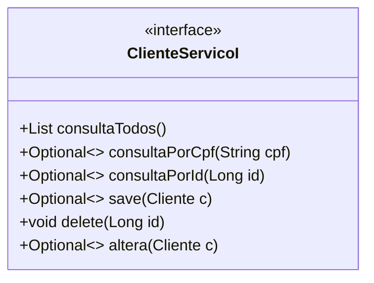
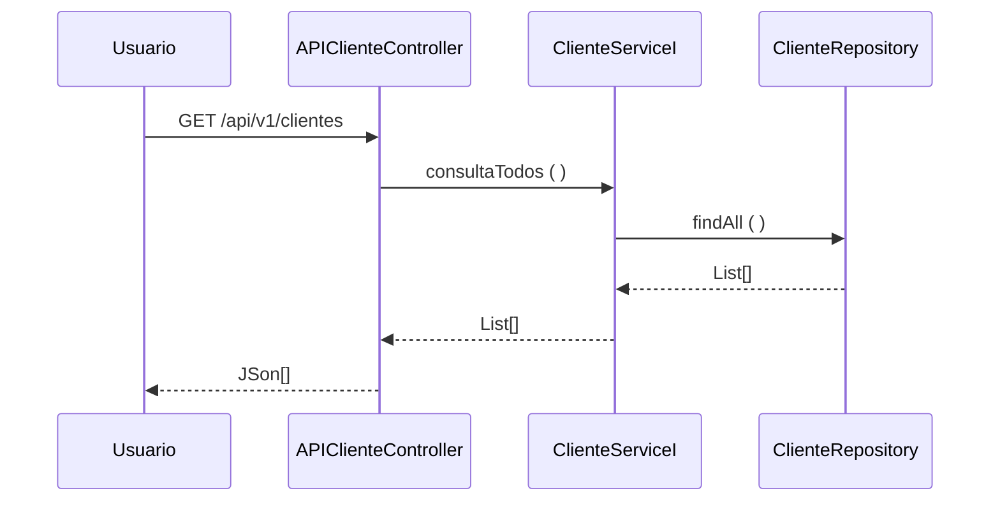

# Aula4
### Fatec ZL - Centro Paula Souza 
##### Disciplina - Programação Web III 
Grupo __
- [Ernesto](https://github.com/Erne1984)
- [Leornado](https://github.com/Leohgb)
- [Pablo Angel Choque Flores](https://github.com/PACFWL)  
##### Processo de Desenvolvimento de Software - PDS
> O Projeto Interdisciplinar segue uma abordagem interativa incremental adaptada do Scrum. Cada interação tem uma definição de pronto estabelecida com objetivo de controlar a qualidade. 
##### Estudo de Caso – Sistema Integrado de Gestão 
> O sistema RADAR proverá a divulgação de pessoas desaparecidas e cadastrar voluntários. 
Esses voluntários irão receber mensagens a respeito de desaparecimentos próximos da região 
de onde ele mora e na página onde será divulgado os desaparecidos haverá além dos detalhes 
sobre a criança, adolescente ou adulto desaparecido; quem o voluntario deve contatar para 
reportar novas informações.
Será integrado back-end ao sistema junto com um banco de dados com as informações 
necessárias para entrar nas conformidades do projeto
##### Product Backlog
- RU01 - Cadastros - Registra e acompanha os processos de registros de informações que serão incluidas no sistema.
- RU02 - Consultas - Informa sobre as informações cadastradas no sistema e que podem ser buscadas.
- RU03 - Gerenciamentos – Excluir e atualizar dados e informações a respeito dos desaparecidos, funcionarios e volúntarios cadastrados.
##### Sprint Backlog 
Cada requisito tem um identificador único de maneira que seja possível rastrear a necessidade do cliente com a implementação do software. 
| Identificador | Descrição | Prioridade |
| ------------ | ------------------------------------------------------------------------ | ------| 
| REQ01 – Cadastrar desaparecido | Como – Funcionario, Eu quero – fazer o cadastro, De maneira que – Armazene o seu registro | Média |
| REQ02 – Consultar desaparecido | Como – Funcionario, Eu quero –  fazer a consulta, De maneira que – Verificar seus dados | Alta | 
| REQ03 – -Atualizar desaparecido | Como – Funcionario, Eu quero – Atualizar os dados de um desaparecido, De maneira que – corrija alguma informação incongruente e atualize os dados | Alta | 
| REQ04 – -Excluir desaparecido | Como – Funcionario, Eu quero – Excluir o cadastro do Desaparecido, De maneira que – o registro seja excluindo permanentemente | Baixa| 
| REQ05 – Cadastrar funcionário | Como – Funcionário, Eu quero – Cadastrar informações do funcionário, De maneira que –  os funcionarios possam acessar o Sistema e gerenciar os registros de desaparecidos | Baixa | 
| REQ06 –  Consultar funcionário | Como – Funcionário, Eu quero – Visualizar os dados do funcionário, De maneira que – possa visualizar o nome, cpf, matricula e outros dados references ao funcionario | Baixa | 
| REQ07 – Atualizar funcionário | Como – Funcionário, Eu quero – Atualizar os dados do funcionário, De maneira que – corrija dados inconsistentes e atualize os registros | Baixa |
| REQ08 – Excluir funcionário | Como – Funcionário, Eu quero – Exclusão dos dados do funcionário, De maneira que – apenas exclua o registro do funcionario da Lista de funcionarios | Baixa |
| REQ09 – Cadastrar voluntario  | Como – Voluntario, Eu quero – Incluir um cadastro de voluntario, De maneira que – possa me tornar Voluntario e colaborar na procurar de pessoas desaparecidas | Baixa |  
| REQ10 – Atualizar voluntario  | Como –  Funcionario, Eu quero – Modificar os dados do voluntario, De maneira que – Corrija ou atualize os dados dos voluntarios | Baixa |  
| REQ11 – Excluir voluntario  | Como – Funcionario, Eu quero – Ser Desvinculado do sistema , De maneira que – Que os dados sejam removidos do sistema | Baixa |
##### Definição de pronto 
> O sprint será considerado concluido quando: 
> 1) Os casos de teste de aceitação forem executados e obtiverem 100% de satisfatorios. Os casos de teste (CT) são rastreáveis para os requisiitos (REQ). O elo de rastreabilidade 
é estabelecido pelo identificador do caso de teste.
> 2) Depois de executado os casos de teste com 100% de satisfatorios o código deve ser armazenado no github (commit). 
##### Casos de teste 
| Identificador | Cenário de uso | 
| ------------ | ------------------------------------------------------------------------ | 
| REQ01 | Cadastrar desaparecido |
| REQ01CT01 | Dado (setup) que o desaparecido CPF 111.111.111-11 não está cadastrado; Quando (ação) o usuário solicitar o cadastro do desaparecido; Então (resultado esperado) o sistema envia uma mensagem de desaparecido cadastrado com sucesso | 
| REQ01CT02 | Dado (setup) que o desaparecido CPF 111.111.111-11 está cadastrado; Quando (ação) o usuário solicitar o cadastro do desaparecido; Então (resultado esperado) o sistema envia uma mensagem de desaparecido já cadastrado | 
| REQ01CT03 | Dado (setup) que o desaparecido CPF 111.111.111-11 não está cadastrado; Quando (ação) o  usuário solicitar o cadastro do desaparecido sem informações do endereço; Então (resultado esperado) o sistema envia uma mensagem de dados inválidos |
| REQ02 | Cadastrar funcionario |
| REQ02CT01 | Dado (setup) que o funcionario CPF 111.111.111-11 não está cadastrado; Quando (ação) o   usuário solicitar o cadastro do funcionario; Então (resultado esperado) o sistema envia uma mensagem de funcionario cadastrado com sucesso |
| REQ02CT02 | Dado (setup) que o funcionario CPF 111.111.111-11 está cadastrado; Quando (ação) o  usuário solicitar o cadastro do funcionario; Então (resultado esperado) o sistema envia uma mensagem de funcionario já cadastrado |
| REQ02CT03 | Dado (setup) que o funcionario CPF 111.111.111-11 não está cadastrado; Quando (ação) o usuário solicitar o cadastro do funcionario sem informações do endereço; Então (resultado esperado) o sistema envia uma mensagem de dados inválidos |
| REQ03 | Cadastrar Voluntario |
| REQ03CT01 | Dado (setup) que o voluntario CPF 111.111.111-11 não está cadastrado; Quando (ação)  o usuário solicitar o cadastro do voluntario; Então (resultado esperado) o sistema envia uma mensagem de voluntario cadastrado com sucesso |
| REQ03CT02 | Dado (setup) que o o voluntario CPF 111.111.111-11 está cadastrado; Quando (ação) o  usuário solicitar o cadastro do voluntario; Então (resultado esperado) o sistema envia uma mensagem de voluntario já cadastrado |
| REQ03CT03 | Dado (setup) que o voluntario CPF 111.111.111-11 não está cadastrado; Quando (ação) o  usuário solicitar o cadastro do voluntario sem informações do endereço; Então (resultado esperado) o sistema envia uma mensagem de dados inválidos |

> 
O modelo de dominio foi definido considerando as seguintes classes:

A arquitetura segue uma abordagem orientada a serviços. Os serviços foram classificados em três tipos (ERL, 2007): 
- **1. Serviços utilitários**. Implementam funcionalidades comuns a vários tipos de aplicações, como, por exemplo: log, notificação, transformação de informações. Um exemplo de serviço utilitário é um serviço de conversão de moeda que 
poderá ser acessado para calcular a conversão de uma moeda (por exemplo, dólares) para outra (por exemplo, euros). 
- **2. Serviços de entidade (serviços de negócios)**. Derivado de uma ou mais entidades de negócio (domínio), possuindo um alto grau de reutilização. Geralmente são serviços que fazem operações CRUD (Create, Read, Update e Delete). 
- **3. Serviços de tarefa (coordenação de processos-workflow)**. Tipo de serviço mais específico que possui baixo grau de reuso. Consome outros serviços para atender seus consumidores. São serviços que suportam um processo de negócios 
amplo que geralmente envolve atividades e atores diferentes. Um exemplo de serviço de coordenação em uma empresa é um serviço de pedidos em que os pedidos são feitos, os produtos são aceitos e os pagamentos são efetuados. 
A visão lógica da arquitetura para API de Cliente é apresentada na figura abaixo. A visã lógica descreve como o código está organizado, as classes os pacotes e os relacionamentos entre eles. 
 
>A entidade Cliente foi identificada como um serviço (ERL, 2007 - serviço do tipo entidade) o contrado das operações de sistema (LARMAN, 2006, pag.140) foram definidas no diagrama abaixo. 

>O diagrama de sequência descreve como os varios componentes arquiteturais colaboram para manipular uma operação de sistema (exemplo para operação consultaTodos()) 

>Referencias 
- [1] KRUCHTEN, Philippe. Reference: Title: Architectural blueprints—the “4+ 1” view model of software architecture. IEEE software, v. 12, n. 6, 1995. 
- [2] RICHARDSON, Chris. Microservices patterns: with examples in Java. Simon and Schuster, 2018. 
- [3] ERL, Thomas. SOA principles of service design (the Prentice Hall service-oriented computing series from Thomas Erl). Prentice Hall PTR, 2007. 
- [4] LARMAN, Craig. Utilizando UML e padrões. 2aed., Porto Alegre: Bookman Editora, 2006 (pag. 147).

